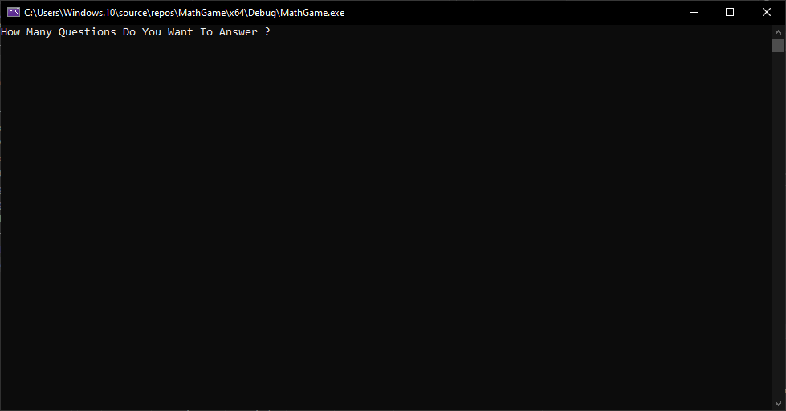
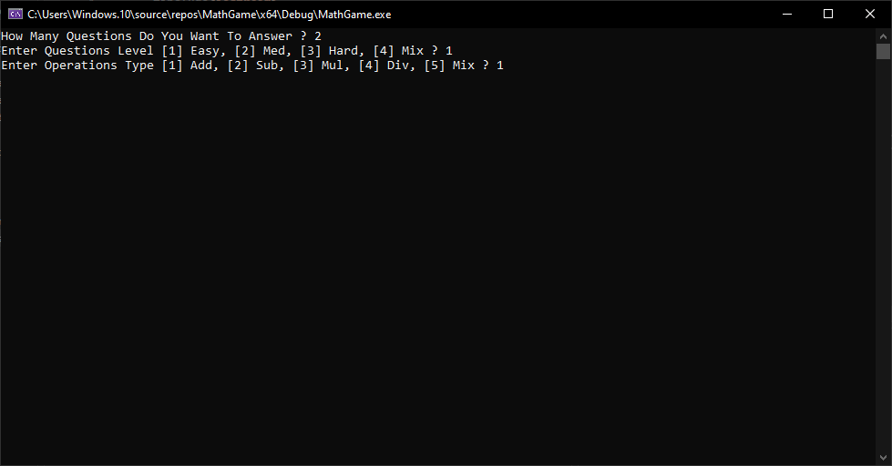
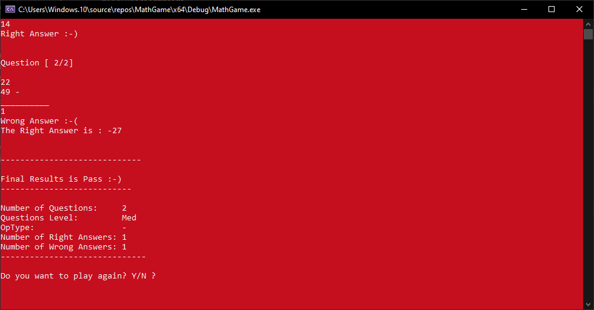
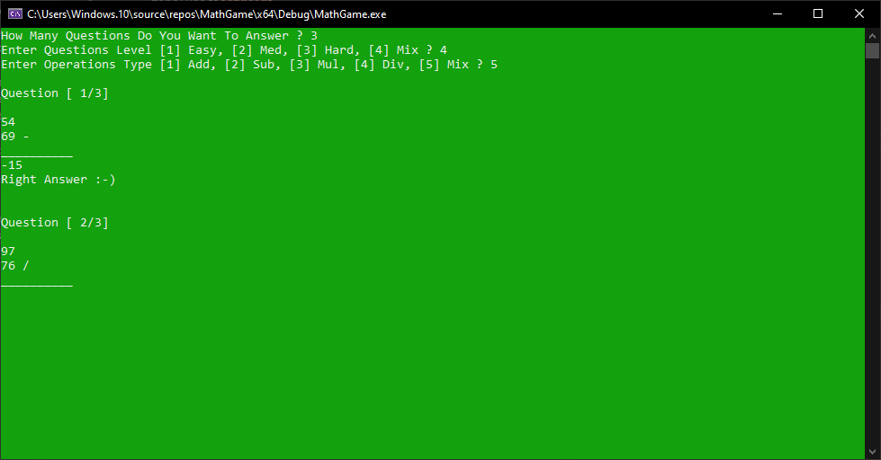
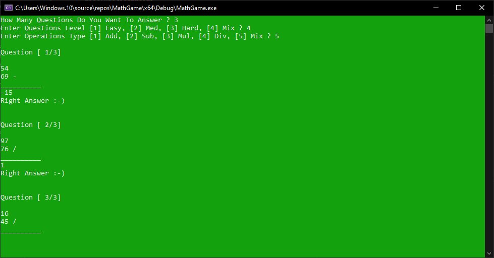
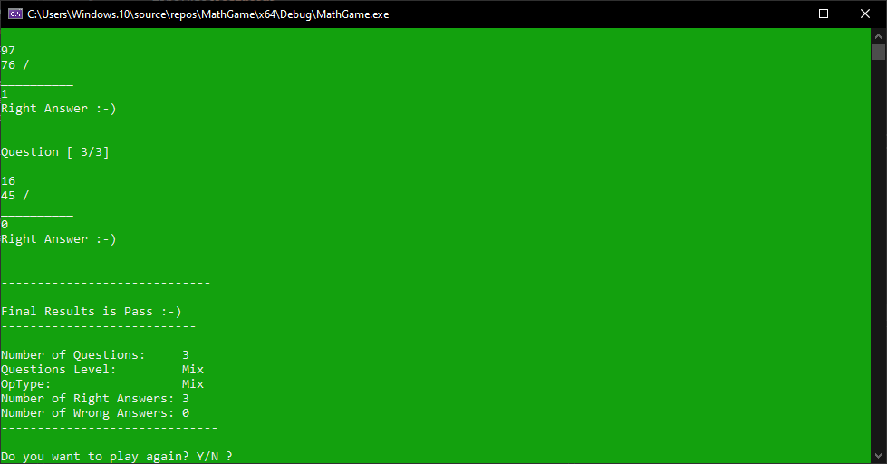
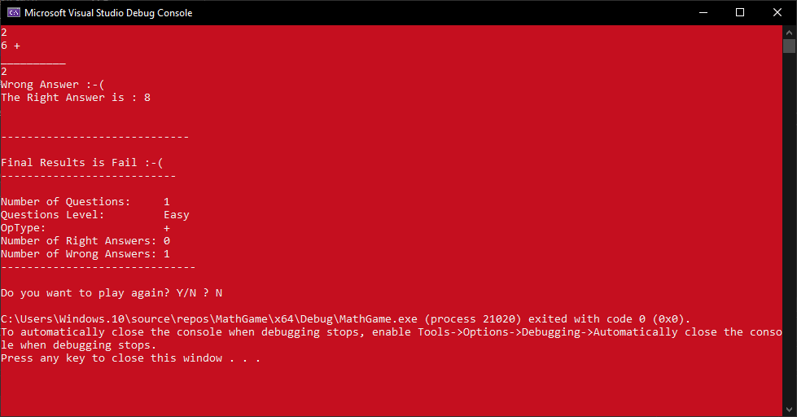

# Math Quiz Game 🧮

A professional C++ console implementation of a customizable math quiz game with multiple difficulty levels and operation types.

## 🎮 Gameplay Screenshots

### Game Start

*Starting the game - entering the number of questions for the quiz*

### Quiz Configuration  

*Configuring quiz settings - selecting difficulty level and operation type*

### Correct Answer (Easy)

*Correct answer in easy mode - green feedback for right answer*

### Wrong Answer (Medium)

*Wrong answer in medium mode - red feedback with correct answer shown*

### Multiple Rounds (Mix)

*Multiple rounds in mix mode - progression through different questions*

### Correct Answer (Division)

*Correct answer in division - integer division with proper result*

### Final Results (Pass)

*Passing final results - comprehensive statistics with pass status*

### Final Results (Fail)

*Failing final results - statistics showing need for improvement*

##  Project Context

This project was developed as part of the 05 - Algorithms & Problem-Solving Level 2 Course by Dr. Mohammed Abu-Hadhoud/Programming Advices. The game concept was provided as a course exercise, but the entire code implementation, structure, and additional features were developed from scratch by me.


## Features

- **Multiple difficulty levels**: Easy, Medium, Hard, and Mix modes
- **Multiple operation types**: Addition, Subtraction, Multiplication, Division, and Mix  operations
- **Multiple rounds**: Choose between 1-10 questions per session
- **Colorful console interface** with visual feedback
- **Detailed game statistics** and question history
- **Play-again functionality** for continuous gameplay
- **Real-time results** with winner highlighting
- **Sound effects** for incorrect answers
- **Input validation** for robust user experience

## Quick Start


### Prerequisites
- C++ compiler (GCC, Clang, or MSVC)
- Windows OS (for color support)

### Compile & Run
```bash
# Compile the project
g++ -o MathGame main.cpp

# Run the game
./MathGame
```

### Using Visual Studio

Open the project folder in Visual Studio
Create a new Empty C++ Project
Add main.cpp to your project
Build the solution (Ctrl+Shift+B)
Run the program (F5)


## How to Play

Run the executable

Enter number of questions when prompted (choose between 1-10)

### Select difficulty level:

Type 1 for Easy (numbers 1-10)

Type 2 for Medium (numbers 10-50)

Type 3 for Hard (numbers 50-100)

Type 4 for Mix (random difficulty)

### Choose operation type:

Type 1 for Addition (+)

Type 2 for Subtraction (-)

Type 3 for Multiplication (×)

Type 4 for Division (÷)

Type 5 for Mix (random operations)


For each question, enter your answer

View question results with color-coded feedback (Green=Correct, Red=Incorrect, with correct answer shown)

See final statistics and pass/fail results after all questions

Choose to play again by typing 'Y' or exit by typing 'N'


## Game Rules:

### Difficulty Levels:

Easy: Numbers range from 1 to 10

Medium: Numbers range from 10 to 50

Hard: Numbers range from 50 to 100

Mix: Randomly selects from all difficulty levels

### Operation Types:

Addition (+): Number1 + Number2

Subtraction (-): Number1 - Number2

Multiplication (×): Number1 × Number2

Division (÷): Number1 ÷ Number2 (integer division)

Mix: Randomly selects from all operation types

### Pass/Fail Criteria:
Pass: Number of right answers ≥ Number of wrong answers

Fail: Number of wrong answers > Number of right answers


## Project Structure

MathGame/

├── screenshots/

│   ├── 1-game-start.PNG

│   ├── 2-quiz-configuration.PNG

│   ├── 3-correct-answer-easy.PNG

│   ├── 4-wrong-answer-medium.PNG

│   ├── 5-multiple-rounds-mix.PNG

│   ├── 6-correct-answer-division.PNG

│   ├── 7-final-results-pass.PNG

│   └── 8-final-results-fail.PNG

├── main.cpp                 # Main game implementation

├── README.md                # Project documentation

├── LICENSE                  # MIT License

└── .gitignore              # Git ignore rules

## Code Architecture

The project uses clean, modular C++ with:

Enum-based states for question levels and operation types

Struct-based data management for questions and quiz sessions

Randomized question generation based on selected parameters

Color-coded UI for enhanced learning experience

Input validation for error-free interaction

### Key Functions:

PlayMathGame() - Manages the main game flow

GenerateQuestion() - Creates random math problems

AskAndCorrectQuestionListAnswers() - Handles answer processing

PrintQuizzResults() - Displays comprehensive statistics

SimpleCalculator() - Performs arithmetic operations

SetScreenColor() - Changes console color based on answer correctness

## UI/UX Features

Clean console interface with proper formatting and tabs

Dynamic color changes based on answer correctness:

Green: Correct answers

Red: Incorrect answers (with beep sound and correct answer shown)

Detailed question information showing both numbers and operation

Comprehensive game statistics including:

Total questions answered

Right vs. wrong answers count

Difficulty level used

Operation type used

Final pass/fail status

Visual separation between different sections (configuration, questions, results)

Question counter showing progress (e.g., "Question [3/5]")

## Contributing

Contributions, issues, and feature requests are welcome! Feel free to check issues page if you want to contribute.

Fork the repository

Create a feature branch (git checkout -b feature/improvement)

Commit your changes (git commit -m 'Add some improvement')

Push to the branch (git push origin feature/improvement)

Open a Pull Request

## License
This project is licensed under the MIT License - see the LICENSE file for details.

## Author
Mahmoud Amin
GitHub: @Mahmoud-Amin-de

## Attribution
*Game concept inspired by "Algorithms & Problem-Solving Level 2 Course" by Dr. Mohammed Abu-Hadhoud/Programming Advices. Code implementation, structure, and additional features developed from scratch by Mahmoud Amin.*

This project demonstrates fundamental C++ concepts including functions, data structures, control flow, and user interaction handling.

